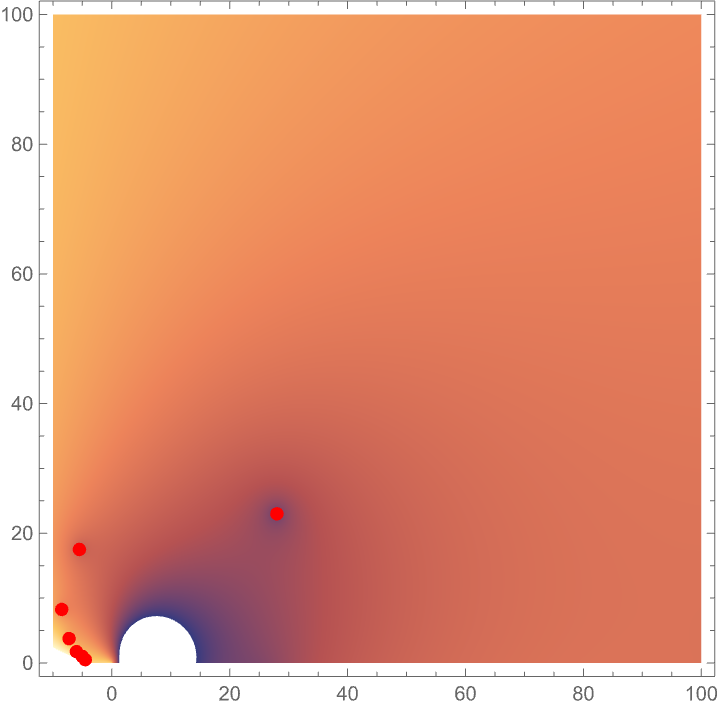
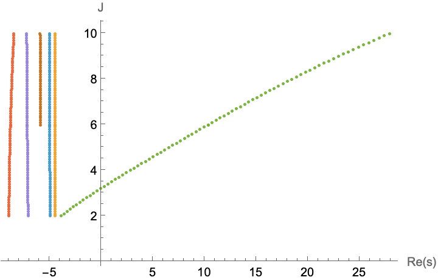
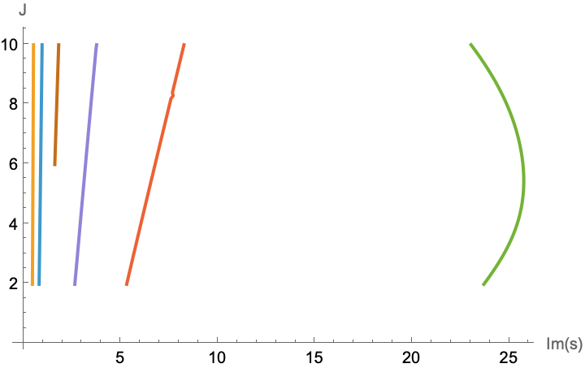
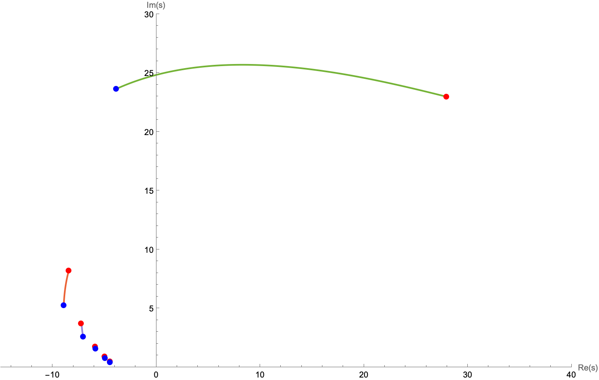

## Trajectories for 6d, N=20, max

Look at the trajectory for $J\in \mathbb R$, looking in the s plane. I start from J=10 and go down using a second order method to track the zeroes (second sheet). The initial s plane:

The trajectories with $Re(s)$ then $Im(s)$ then printed on the s plane:

Blue point is for $J=2$, red for $J=10$.

What I managed to do:

- Have a Froissart-Gribov projection which matches the usual projection for J even to 4 digits of the prescribed precision (p0=16 leads to discrepencies around the 12th digit).
- Follow the zeroes on most of the s plane with a good stability (not yet perfect hence a trajectory not finishing and one not computed). 

Where I still fall short:

- The results don't match the ones on the website and I don't know why.
- The stability could be improved.
- The efficiency may get better. I tried a Julia implementation but with my version, not really any better. 